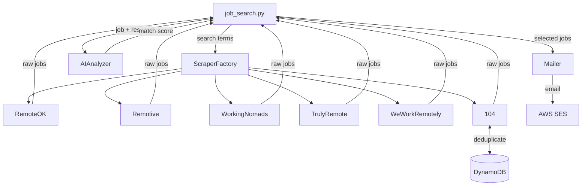

# Job Hunter Bot

[](https://github.com/guillaume-martin/job-hunter-bot/actions/workflows/tests.yml)
[](https://www.python.org/)
[](https://aws.amazon.com/)
[](LICENSE)


Job hunting is time-consuming — finding openings that actually match your skills requires
checking multiple boards every day. Job Hunter Bot automates that process by scraping remote
job boards, scoring each listing against your resume using AI, and delivering only the best
matches to your inbox.

Some job boards let recruiters refresh their listings daily to stay at the top of search
results. To avoid seeing the same listings every day, the bot tracks previously scraped jobs
in a DynamoDB cache and filters them out on subsequent runs.

---

## 📚 Table of Contents
- [Features](#features)
- [Demo](#-demo)
- [Architecture](#architecture)
- [Tech Stack](#tech-stack)
- [Getting Started](#getting-started)
- [Adding a New Scraper](#adding-a-new-scraper)
- [Roadmap](#roadmap)

---

## ✨ Features

- Scrapes multiple remote job boards (Remotive, RemoteOK, We Work Remotely, Working Nomads, Truly Remote, 104)
- Scores each listing against your resume using AI to surface the best matches
- Filters by search term and location (Worldwide / APAC)
- Tracks previously seen listings in DynamoDB to avoid duplicates across daily runs
- Delivers new matches by email via AWS SES
- Configurable retention window — cached listings expire automatically via DynamoDB TTL
- Extensible scraper architecture: add a new board by implementing a single base class

---

## 📸 Demo

The bot generates a dated Markdown file for each run. Example output:

| Title | Company | Match Score | Date Published | Missing Required Skills |
| ----- | ------- | ----------- | -------------- | ----------------------- |
| [Senior Backend Engineer](https://example.com/jobs/123) | Acme Corp | 92/100 | 2025-12-08 | |
| [Staff Platform Engineer](https://example.com/jobs/456) | Globex Inc | 85/100 | 2025-12-08 | Kubernetes, Helm |
| [Cloud Infrastructure Engineer](https://example.com/jobs/789) | Initech | 78/100 | 2025-12-07 | Terraform, AWS CDK |
| [DevOps Engineer](https://example.com/jobs/101) | Umbrella Corp | 72/100 | 2025-12-07 | Go Programming Language, CI/CD Pipeline |
| [Site Reliability Engineer](https://example.com/jobs/112) | Hooli | 65/100 | 2025-12-06 | Expert-level Kubernetes, On-call experience |

---

## 🏗️ Architecture


---

## 🛠️ Tech Stack

| Layer                 | Technology                         |
|-----------------------|------------------------------------|
| Language              | Python 3.11+                       |
| Dependency management | Poetry                             |
| Scraping              | Requests, BeautifulSoup4, Selenium |
| Storage               | AWS DynamoDB                       |
| Email delivery        | AWS SES                            |
| Infrastructure        | Terraform + Terragrunt             |
| Containerization      | Docker                             |
| CI/CD                 | GitHub Actions                     |
| Testing               | Pytest                             |

---

## 📁 Project Structure

```
job-hunter-bot/
├── .github/
│   └── workflows/          # GitHub Actions pipelines
├── docker/                 # Dockerfile and compose files
├── iac/
│   └── environments/       # Terraform + Terragrunt configuration
├── src/
│   ├── config.py           # Centralized configuration
│   ├── scrapers/
│   │   ├── base_scraper.py # Abstract base class for all scrapers
│   │   ├── remotive.py
│   │   ├── remoteok.py
│   │   ├── wwr.py
│   │   └── ...
│   └── ...
├── tests/
│   ├── e2e/
│   ├── integration/
│   └── unit/
├── Makefile
├── pyproject.toml
└── README.md
```

---

## 🚀 Getting Started

### 📋 Prerequisites

- Python 3.11+
- [Poetry](https://python-poetry.org/docs/#installation)
- AWS credentials configured (`~/.aws/credentials` or environment variables)
- A DynamoDB table for job caching
- An AWS SES verified sender address

### 📦 Installation

```bash
git clone https://github.com/guillaume-martin/job-hunter-bot.git
cd job-hunter-bot
poetry install
```

### ⚙️ Configuration

#### Environment Variables
1. Create the `.env` file
```bash
cp src/template.env src/.env
```

2. Update the variables
Open `src/.env` and fill in the required values. Every variable in the file is required unless marked optional.

> **Never commit `.env` to version control.**


### 💻 Running locally

```bash
# Build the Docker image
make build

# Run the bot
make run
```

The `run` target mounts your local AWS credentials into the container, so no additional AWS configuration is needed inside Docker.

### ☁️ Running in the cloud

🚧 Coming Soon

### 🧪 Run the tests

```bash
poetry run pytest tests/unit/ -v

# Or via Makefile:
make test
```

---

## 🔌 Adding a New Scraper

1. Create a new file in `src/scrapers/`, e.g. `myboard.py`
2. Implement `BaseScraper`:

```python
from .base_scraper import BaseScraper

class MyBoardScraper(BaseScraper):

    def __init__(self):
        super().__init__(base_url="https://myboard.com", name="myboard")

    def get_jobs(self, term: str) -> list[dict]:
        ...

    def extract_company(self, job_element) -> str:
        ...

    def extract_title(self, job_element) -> str:
        ...

    def extract_url(self, job_element) -> str:
        ...

    def extract_date_published(self, job_element) -> str:
        ...

    def extract_job_description(self, job_url: str) -> str:
        ...
```

3. Register it in `scraper_factory.py`:

```python
from .myboard import MyBoardScraper

scrapers = {
    ...
    "myboard": MyBoardScraper,
}
```

---

## 🗺️ Roadmap

- [x] Refactor all scrapers to use the new `BaseScraper` architecture
- [x] Expand unit test coverage across all scrapers
- [ ] Add integration tests for all scrapers
- [ ] Complete IaC scripts with Terraform and Terragrunt
- [ ] Build full CI/CD pipeline with GitHub Actions (lint → test → deploy)
- [ ] Add monitoring and alerting (CloudWatch metrics, error notifications)

---

## 🤝 Contributing

Issues and pull requests are welcome. Please open an issue first to discuss
what you'd like to change.

---

## 📄 License

Distributed under the GPL-3.0 License. See [LICENSE](LICENSE) for details.
