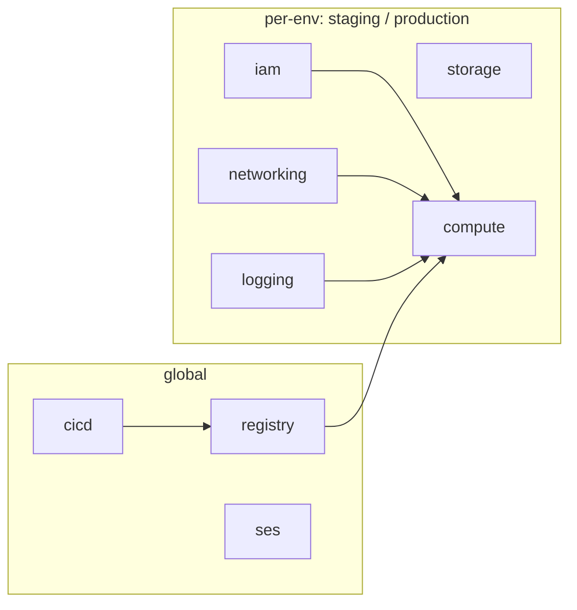

# Infrastructure (IaC)

This folder contains the Terraform/OpenTofu code, orchestrated by Terragrunt,
that provisions everything needed to run Job Hunter Bot on AWS: ECR registry,
IAM roles, DynamoDB cache, VPC, ECS Fargate task, EventBridge schedule, SES
sender identity, and a CloudWatch log group.

## Layout

```
iac/
├── Makefile            # Read-only shortcuts: state, plan, outputs
│
├── modules/            # Reusable Terraform modules (application-specific)
│   ├── cicd/           # GitHub OIDC provider + CI/CD role
│   ├── compute/        # ECS cluster, task definition, EventBridge scheduler
│   ├── iam/            # Per-env IAM: execution, task, scheduler roles
│   ├── networking/     # VPC, public subnet, route table, security group
│   └── ses/            # SES verified identity for outbound email
│
└── environments/       # Terragrunt stacks — one deployable unit per folder
    ├── root.hcl            # Shared backend, provider, default tags
    ├── common_vars.hcl     # Region, profile, project, cost center
    ├── component_vars/     # Shared module source + inputs
    │
    ├── global/             # Cross-environment resources
    │   ├── cicd/           # OIDC provider + CI/CD role (modules/cicd)
    │   ├── registry/       # ECR repository (upstream module)
    │   └── ses/            # SES sender identity (modules/ses)
    │
    ├── staging/
    │   ├── environment.hcl
    │   ├── networking/
    │   ├── iam/            # Execution, task, scheduler roles (modules/iam)
    │   ├── storage/        # DynamoDB jobs-cache (upstream module)
    │   ├── logging/        # CloudWatch log group (upstream module)
    │   └── compute/        # ECS task + scheduler (modules/compute)
    │
    └── production/         # Same layout as staging
```

`modules/` holds the Terraform code; `environments/` holds the Terragrunt
configuration that wires modules into a concrete deployment. Some stacks pull
community modules from GitHub (registry, storage, logging), the rest source
local modules from this repo.

### Stack inventory

| Scope       | Stack         | Module source                                    |
| ----------- | ------------- | ------------------------------------------------ |
| global      | `cicd`        | `modules/cicd`                                   |
| global      | `registry`    | `terraform-aws-modules/terraform-aws-ecr`        |
| global      | `ses`         | `modules/ses`                                    |
| per-env     | `iam`         | `modules/iam`                                    |
| per-env     | `networking`  | `modules/networking`                             |
| per-env     | `storage`     | `terraform-aws-modules/terraform-aws-dynamodb-table` |
| per-env     | `logging`     | `terraform-aws-modules/terraform-aws-cloudwatch` |
| per-env     | `compute`     | `modules/compute`                                |

### Dependency graph

Terragrunt walks this DAG on every `run-all` invocation.



### Why IAM is split

`cicd/` lives in `global/` and manages what crosses the boundary with GitHub:
the OIDC provider and the role CI/CD workflows assume. `iam/` lives in each
environment and manages the ECS execution, task, and scheduler roles — scoped
tightly to that environment's DynamoDB table, SSM parameters, and SES usage.

The split keeps the blast radius of per-environment IAM contained, while the
CI/CD trust with GitHub stays account-wide.

## Prerequisites

Install [OpenTofu](https://opentofu.org/) (or Terraform) ≥ 1.0,
[Terragrunt](https://terragrunt.gruntwork.io/), and
[AWS CLI](https://aws.amazon.com/cli/) v2. You need an AWS account with
permissions to create every resource listed above, and a named CLI profile
that matches `aws_profile` in
[`environments/common_vars.hcl`](environments/common_vars.hcl) (default:
`iac-job-hunter-bot`).

### Required environment variables

Read via `get_env` at plan/apply time — export them in your shell or use
`direnv` before any `terragrunt` command.

| Variable     | Used by                          | Example               |
| ------------ | -------------------------------- | --------------------- |
| `SENDER`     | `global/ses`, `<env>/compute`    | `bot@your-domain.com` |
| `RECIPIENT`  | `<env>/compute`                  | `you@your-domain.com` |
| `AI_API_KEY` | `<env>/compute` (stored in SSM)  | your Mistral API key  |

## Configuration

Three layers, from most global to most specific:

1. [`environments/common_vars.hcl`](environments/common_vars.hcl) — AWS
   region, profile, project name, cost center. Shared by every stack.
2. `environments/<env>/environment.hcl` — the environment name (`global`,
   `staging`, `production`). Feeds resource names, IAM scoping, tags, and
   the state bucket.
3. Per-stack `terragrunt.hcl` — module source, inputs, dependencies on other
   stacks.

Resources follow the convention `${project}-${environment}-${component}-*`
(e.g. `job-hunter-bot-staging-compute-ecs-cluster`). The DynamoDB table and
SSM parameter paths are scoped the same way and referenced by the task role.

## First-time setup

### 1. State bucket

Each environment writes its state to its own S3 bucket, named
`iac-tfstate-<environment>` (see [root.hcl](environments/root.hcl)).

> ⚠️ The buckets must exist **before** the first `terragrunt` run — the
> backend is not auto-bootstrapped.

```bash
aws s3api create-bucket \
  --bucket iac-tfstate-global \
  --region us-east-1 \
  --profile iac-job-hunter-bot
aws s3api put-bucket-versioning \
  --bucket iac-tfstate-global \
  --versioning-configuration Status=Enabled \
  --profile iac-job-hunter-bot
```

Repeat for `iac-tfstate-staging` and `iac-tfstate-production`.

### 2. AWS profile

```bash
aws configure --profile iac-job-hunter-bot
```

Or rename the profile by editing `aws_profile` in
[`common_vars.hcl`](environments/common_vars.hcl).

### 3. SES sending domain

Email delivery requires a verified SES identity. After the first apply of
`global/ses`, finalize the DKIM/DMARC records at your DNS provider before
the bot can send.

## Deployment

Stacks have dependencies resolved automatically by Terragrunt. Deploy the
shared pieces first, then the target environment:

```bash
terragrunt run-all plan  --working-dir environments/global
terragrunt run-all apply --working-dir environments/global

terragrunt run-all plan  --working-dir environments/staging
terragrunt run-all apply --working-dir environments/staging
```

`run-all` walks the DAG shown above. During `plan`, downstream stacks see
[`mock_outputs`](https://terragrunt.gruntwork.io/docs/reference/config-blocks-and-attributes/#mock_outputs)
for any dep that hasn't been applied yet — this is expected; the real values
flow through at apply time.

### Single stack

```bash
terragrunt --working-dir environments/staging/compute plan
terragrunt --working-dir environments/staging/compute apply
```

### After the first apply

1. Push a container image tagged `staging` (or `production`) to the ECR repo
   created by `global/registry`. The CI/CD role ARN exported by `global/cicd`
   is consumed by the GitHub Actions workflow.
2. Confirm the EventBridge schedule triggers the task on the cron expression
   set in `<env>/compute/terragrunt.hcl` (default: `5 0 * * *`).
3. Tail the CloudWatch log group to watch the first run.

## Makefile shortcuts

A small [Makefile](Makefile) wraps the most common read-only Terragrunt
commands — useful for a quick view of an environment without remembering the
full `--working-dir` flag.

| Command                  | Purpose                                              |
| ------------------------ | ---------------------------------------------------- |
| `make state ENV=<env>`   | List resources tracked in Terraform state           |
| `make plan ENV=<env>`    | Run terragrunt plan across every stack               |
| `make outputs ENV=<env>` | Show outputs of every stack                          |

`ENV` defaults to `staging`. Destructive commands (`apply`, `destroy`) are
**not** wrapped — run them by hand so the intent is explicit.

## Inspecting deployed resources

State-side (what IaC believes exists):

```bash
make state ENV=staging
# or for a single stack:
terragrunt --working-dir environments/staging/<stack> state list
terragrunt --working-dir environments/staging/<stack> output
```

AWS-side (what actually exists, across all stacks, via tags):

```bash
aws resourcegroupstaggingapi get-resources \
  --tag-filters "Key=project,Values=job-hunter-bot" \
  --query 'ResourceTagMappingList[].ResourceARN' --output table
```

## Teardown

Destroy in reverse dependency order: per-env first, then global.

```bash
terragrunt run-all destroy --working-dir environments/staging
terragrunt run-all destroy --working-dir environments/global
```

> ⚠️ The state buckets are **not** managed by Terragrunt — remove them
> manually if you want to wipe everything.

## Conventions

- **Naming** — `${project}-${environment}-${component}-*` for AWS resources;
  default tags `project`, `env`, `component`, `managed-by`, `cost-center`,
  `owner` applied by [root.hcl](environments/root.hcl).
- **Versions** — the AWS provider is pinned to `~> 6.0`. Community modules
  are pinned by tag (`ref=v<version>`) in their `terragrunt.hcl`.
- **Secrets** — never committed. `SENDER`, `RECIPIENT`, `AI_API_KEY` come
  from the shell; `AI_API_KEY` is written to SSM Parameter Store by the
  compute stack and injected into the ECS task at runtime.
